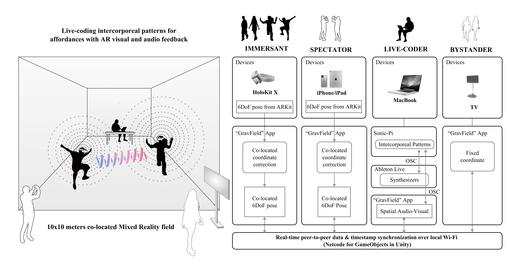
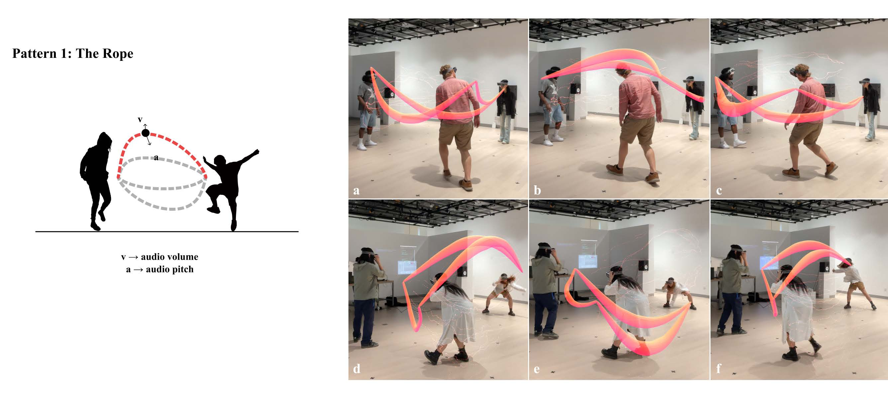
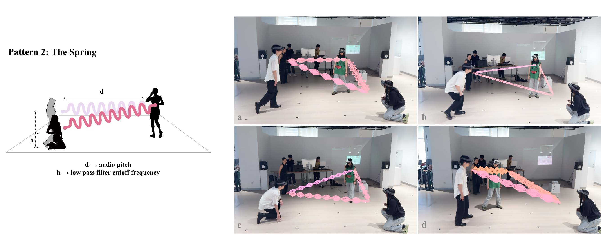
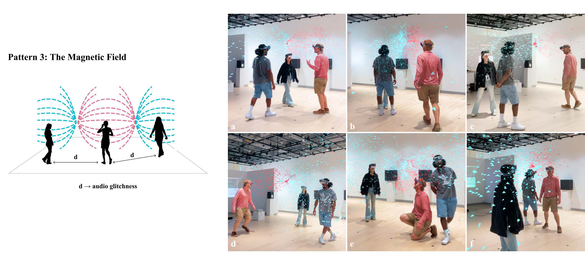
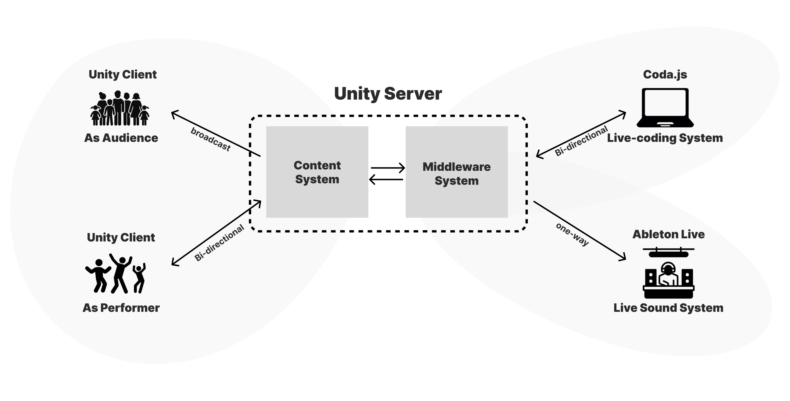

# GravField
GravField (short for "Gravitational Field") is an experimental and participatory inter-bodily live-coding performance system within a collocated mixed reality. This WiP aims to explore the vast potential of intercorporeal signals, creating a communicative, playful, and co-creative space where players’ interconnected bodies become the instruments of expression.

## Structure

## Affordances
GravField now has 3 types of affordances available. They are ***Rope***, ***Spring*** and ***Magnetic Field***. 

## How to run
The entire system consists of three sub-systems: 
- **Content System** 
  Responsible for synchronous display and triggering of effects.
- **Live-coding System** 
  Enables real-time control of Unity Server by Coda.js.
- **Live sound System** 
  Transmits performer's body signals to audio software via Unity Server to control sound variations.  

To experience the complete process, you need to run Unity Project, coda Project, and live Project all together and configure their local network addresses.  
***Please refer to each respective subdirectory for their individual setup instructions.***
> Each system operates independently, and you can also choose not to run one of them.

