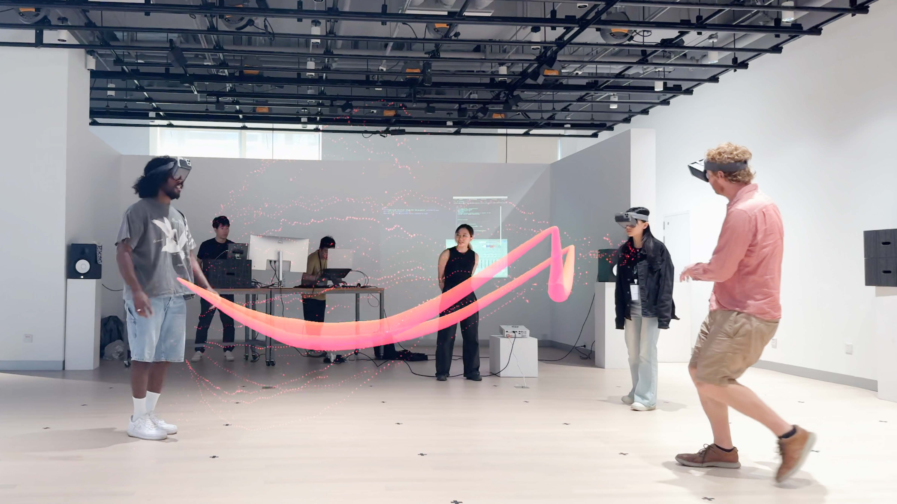
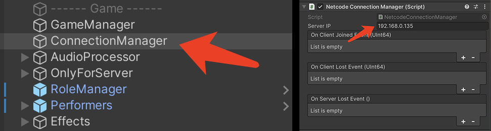

# GravField
GravField (short for "Gravitational Field") is an experimental and participatory inter-bodily live-coding performance system within a collocated mixed reality. This WiP aims to explore the vast potential of intercorporeal signals, creating a communicative, playful, and co-creative space where players’ interconnected bodies become the instruments of expression.

## Structure

## Affordances
GravField now has 3 types of affordances available. They are ***Rope***, ***Spring*** and ***Magnetic Field***. 

## How to run
The entire system consists of three sub-systems: 
- **Content System** 
  Responsible for synchronous display and triggering of effects.
- **Live-coding System** 
  Enables real-time control of Unity Server by Coda.js.
- **Live sound System** 
  Transmits performer's body signals to audio software via Unity Server to control sound variations.  

To experience the complete process, you need to run Unity Project, coda Project, and live Project all together and configure their local network addresses.  
***Please refer to each respective subdirectory for their individual setup instructions.***
> Each system operates independently, and you can also choose not to run one of them.

# Unity Project for GravField
Both the client and server components of GravField are developed using Unity and are integrated within this single project.

 

## How to play
### As Client:
  When acting as a client, you can choose between two roles:
  - **As Performer**: Triggers effects and participates in the performance. The performance content will be visible to everyone.
  - **As Audience**：Observes as a spectator, freely navigating the world to view the visual content created by performers.
### As Server：
  Since GravField involves multiple parties in a networked application, a separate device is required to act as the server. There are two ways to operate as the server:
  - **Run the application in Unity Editor.** Through this way,server will have full functionality.
  - **Run the iOS app as the server.** Through this way, server will lack the Live-coding System and Live Sound System subsystems, but it can still receive OSC control commands.
  

## System Requirement:
Unity Version: 2022.3.20 or above  
Start Scene: Assets/Scenes/GravField_Infrastructure

## Network Configuration
Due to the complexity of GravField as a networked system, there are many network addresses that need to be configured.

 

### Configuration for Content System:
- **To change Default Server IP** 
  Find "ConnectionManager" in Editor scene, modify "Server IP" in inspector.

 

- **To change Server IP when playing** 
  Go to "Settings" in the app, modify "Server IP", press Enter.

 

### Configuration for Middleware System:
Folder: Assets/Scenes/GravField_Infrastructure/Assets

- **UDP from Coda:**  
  File: OscConnectionReceiverFromCoda 
  Default IP: 127.0.0.1, Port: 13600  
- **UDP to Coda:**  
  File: OscConnectionSenderToCoda 
  Default IP: 127.0.0.1,  Port: 13500  
- **UDP to Live:**  
  File: OscConnectionSenderToLive 
  Default IP: 192.168.0.136,  Port: 7000

## For Testing
### Solo Mode:
  If you don't have people around you to test, you can enable Solo Mode. In Solo mode, it will play a video in which 3 performers are dancing and send you osc signals at the same time.

> **To enable Solo mode, press "s" before server starts. Please note that server will automatically start after 5 seconds if there's no input.**

### ShortCut:
- F5: Toggle Panel of parameters sent to Live 
- F6: Toggle Panel of parameters received from Coda
- F8: Toggle Info Panel
- Alpha 1: Chane to "Chain" Mode
- Alpha 2: Chane to "Spring" Mode
- Alpha 3: Chane to "Magmetic" Mode
